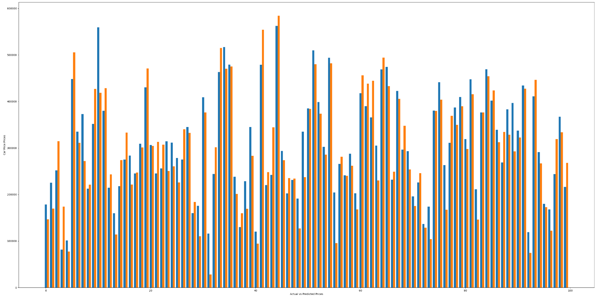

## Car Price Prediction

A regression model to accurately predict car prices based on various features. This project utilizes neural network to learn from historical data and estimate car prices.

## Project Overview

The Car Price Prediction model is a regression model built with a Sequential neural network architecture in TensorFlow. It takes in car-related features and outputs an estimated price.

## Key Features
- Neural network with multiple layers to capture complex data patterns.
- Normalizes input features for improved model performance.
- Optimized using the Adam optimizer and evaluated with Mean Absolute Error (MAE) and Root Mean Squared Error (RMSE) metrics.
- Trained on historical car data to make accurate predictions.

## Model Architecture

The model architecture includes:
- **Input Layer**: Accepts 8 features related to car details.
- **Normalization Layer**: Scales input features for better learning efficiency.
- **Hidden Layers**: Three dense layers with 128 neurons each, using ReLU activation to capture non-linear relationships.
- **Output Layer**: A single neuron providing the predicted car price.

## Model Training

The model was trained with the Adam optimizer, which adapts the learning rate for each parameter. The primary loss function is Mean Absolute Error (MAE), and Root Mean Squared Error (RMSE) serves as an additional evaluation metric.

## Results

The model was evaluated by comparing actual car prices with the predicted values. Below is a sample visualization of the model's performance:

The chart illustrates the model's ability to closely approximate actual prices, providing a visual assessment of its accuracy.

## Further Improvements

- Fine-tuning the model by experimenting with different architectures and hyperparameters.
- Adding more features, such as car brand, location, and year, for more accurate predictions.
- Exploring advanced techniques, such as transfer learning, to improve performance.